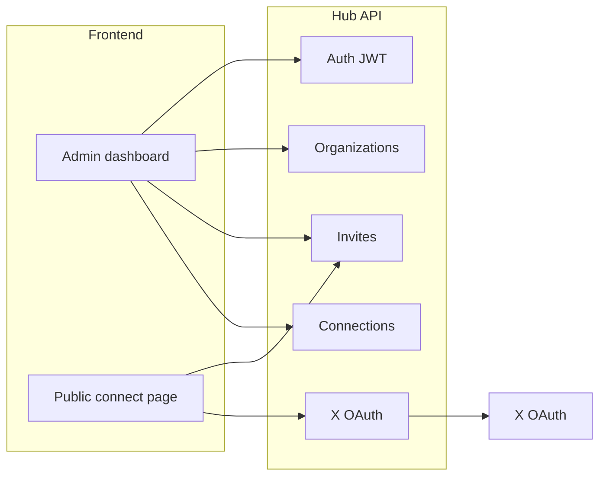

# Create and integrate a frontend with Hub

This guide explains how to scaffold a web app and wire it to the **Hub** NestJS API (`apps/hub`). Hub is the control plane for organizations, X (Twitter) OAuth connections, invites, and org-level prompts. The **Webhook** and **Processor** services run in the background; the frontend talks to Hub only.

There is no frontend app in this monorepo yet. You can add one under `apps/web` in this repo or keep it in a separate repository.

---

## Architecture



| Actor | What they do in the UI |
|-------|------------------------|
| **Org owner/admin** | Register/login, create org, create invite links, list/revoke connections, set per-connection auth tokens, edit system prompt |
| **X account holder** (no Hub login) | Open an invite link, authorize X; Hub stores tokens and registers a webhook |

---

## Prerequisites

1. **Hub running locally** with MongoDB and Redis (see [railway.md](./railway.md) and env templates).
2. **X Developer App** with OAuth 2.0 user context, callback URL matching Hub:
   - Local: `http://localhost:3000/api/v1/oauth/x/callback`
   - Production: `https://<hub-domain>/api/v1/oauth/x/callback`
3. **Environment** merged from `docs/env/shared.env.example` + `docs/env/hub.env.example` (or root `.env.example`).

### Start Hub locally

```bash
yarn install
# Ensure MONGODB_URI, REDIS_URL, JWT_SECRET, TOKEN_ENCRYPTION_KEY, X_* are set in .env
yarn start:hub:dev
```

Hub listens on `PORT` (default **3000**). Health check: `GET /` → `{ "status": "ok" }`. All business routes use prefix **`/api/v1`**.

Verify the full stack with e2e:

```bash
yarn test:hub:e2e
```

---

## Hub configuration for the frontend

Set these in Hub’s environment (not only in the frontend):

| Variable | Purpose |
|----------|---------|
| `HUB_PUBLIC_BASE_URL` | Public Hub URL; used when building `inviteUrl` in API responses |
| `OAUTH_SUCCESS_REDIRECT_URL` | After X OAuth, redirect browser here instead of returning JSON (recommended for SPAs) |
| `X_REDIRECT_URI` | Must stay on **Hub** (`/api/v1/oauth/x/callback`), not your frontend |

Example for local Vite on port 5173:

```bash
HUB_PUBLIC_BASE_URL=http://localhost:3000
OAUTH_SUCCESS_REDIRECT_URL=http://localhost:5173/oauth/success
```

On OAuth success, Hub redirects with query params: `orgId`, `xUserId`, `xUsername`, `webhookId`, `webhookUrl`.

If `OAUTH_SUCCESS_REDIRECT_URL` is unset, `GET /api/v1/oauth/x/callback` returns JSON with the same fields (useful for API testing, awkward for browser UX).

---

## Create the frontend project

### Option A — Monorepo app (`apps/web`)

From the repo root:

```bash
# Example: Vite + React + TypeScript
yarn create vite apps/web --template react-ts
cd apps/web && yarn install
```

Add a dev proxy so the browser calls same-origin `/api` (optional — Hub enables CORS for all origins).

**`apps/web/vite.config.ts`:**

```ts
import { defineConfig } from 'vite';
import react from '@vitejs/plugin-react';

export default defineConfig({
  plugins: [react()],
  server: {
    proxy: {
      '/api': {
        target: 'http://localhost:3000',
        changeOrigin: true,
      },
    },
  },
});
```

Use `VITE_HUB_API_URL=` (empty) in dev so requests go to `/api/v1/...` through the proxy. In production, set `VITE_HUB_API_URL=https://your-hub.railway.app`.

### Option B — Separate repo (e.g. Next.js)

Use [Next.js rewrites](https://nextjs.org/docs/app/api-reference/next-config-js/rewrites) in development:

```js
// next.config.js
module.exports = {
  async rewrites() {
    return [
      {
        source: '/api/:path*',
        destination: `${process.env.HUB_API_URL ?? 'http://localhost:3000'}/api/:path*`,
      },
    ];
  },
};
```

Deploy the frontend on its own host; set `HUB_API_URL` / `NEXT_PUBLIC_HUB_API_URL` to the deployed Hub public URL.

### CORS in production

Hub enables CORS with `origin: '*'` in `apps/hub/src/main.ts`, so browsers can call the API from any frontend origin. Send JWTs via the `Authorization: Bearer` header.

For stricter production policy later, replace `*` with an allowlist in `main.ts` or gate it with an env variable.

Server-side routes (Next.js Route Handlers, server actions) do not need CORS.

---

## Authentication

Hub uses **JWT** bearer tokens.

| Endpoint | Auth | Body |
|----------|------|------|
| `POST /api/v1/auth/register` | None | `{ "email", "password" }` — password min 8 chars |
| `POST /api/v1/auth/login` | None | `{ "email", "password" }` |
| `GET /api/v1/auth/me` | Bearer | — |

Response for register/login:

```json
{ "accessToken": "<jwt>" }
```

Store the token (e.g. `localStorage` key `hub_access_token`) and send on protected routes:

```http
Authorization: Bearer <accessToken>
```

`GET /api/v1/auth/me` returns `{ "id", "email" }`.

---

## API client pattern

Minimal TypeScript helper (adjust paths if not using a proxy):

```ts
const base =
  import.meta.env.VITE_HUB_API_URL?.replace(/\/$/, '') ?? '';

export async function hubFetch<T>(
  path: string,
  options: RequestInit & { token?: string } = {},
): Promise<T> {
  const { token, headers, ...rest } = options;
  const res = await fetch(`${base}/api/v1${path}`, {
    ...rest,
    headers: {
      'Content-Type': 'application/json',
      ...(token ? { Authorization: `Bearer ${token}` } : {}),
      ...headers,
    },
  });
  if (!res.ok) {
    const err = await res.json().catch(() => ({}));
    throw new Error(err.message ?? res.statusText);
  }
  return res.json() as Promise<T>;
}
```

---

## User flows to implement

### 1. Admin onboarding

1. **Register** → save `accessToken`.
2. **Create organization** → `POST /api/v1/orgs` with `{ "name": "Acme" }` (optional `slug`).
3. **Dashboard** → `GET /api/v1/orgs` lists orgs with `role` (`owner` | `admin`).

Only **owner** and **admin** can manage invites, members, prompts, and revoke connections.

### 2. Invite link for X users

1. `POST /api/v1/orgs/:orgId/invites` with optional `{ "expiresInHours": 24, "maxUses": 5 }` (defaults: 168 hours, unlimited uses).
2. Response includes:
   - `inviteToken` — opaque secret
   - `inviteUrl` — Hub URL: `{HUB_PUBLIC_BASE_URL}/api/v1/oauth/x/start?invite=<token>`

Show `inviteUrl` in the admin UI (copy button). Optionally build a branded connect page (below).

### 3. Public connect page (recommended)

Route example: `/connect/:token`

1. `GET /api/v1/invites/:token` (no auth) → `{ orgName, expired, revoked, maxUsesReached }`.
2. If invalid, show an error state.
3. If valid, button links to Hub OAuth start (same as `inviteUrl`):

   ```
   {HUB_PUBLIC_BASE_URL}/api/v1/oauth/x/start?invite={token}
   ```

   Use a normal navigation (`window.location.href = ...`), not `fetch` — Hub responds with a **302 redirect** to X.

### 4. OAuth success page

Route example: `/oauth/success` — must match `OAUTH_SUCCESS_REDIRECT_URL`.

Read query params and show confirmation:

- `orgId`, `xUserId`, `xUsername`, `webhookId`, `webhookUrl`

Do not expose webhook secrets in the UI; Hub does not return them on this redirect.

### 5. Connections list (admin)

`GET /api/v1/orgs/:orgId/connections` (member or admin)

```json
[
  {
    "id": "...",
    "xUserId": "...",
    "xUsername": "handle",
    "scopes": ["tweet.read", "..."],
    "connectedAt": "...",
    "tokenExpiresAt": "...",
    "webhookId": "...",
    "webhookUrl": "https://webhook.../api/v1/webhooks/incoming/...",
    "hasAuthToken": false
  }
]
```

**Set auth token** (admin only) — used by downstream automation:

`PATCH /api/v1/orgs/:orgId/connections/:connectionId/auth-token`

```json
{ "authToken": "your-secret" }
```

**Revoke connection** (admin only):

`DELETE /api/v1/orgs/:orgId/connections/:connectionId`

### 6. Organization prompts (admin)

`PATCH /api/v1/orgs/:orgId/prompt`

```json
{
  "systemPrompt": "You are ...",
  "unknownReply": "I don't know"
}
```

`GET /api/v1/orgs/:orgId` returns `systemPrompt` and `unknownReply` for editing.

### 7. Invites management (admin)

| Method | Path |
|--------|------|
| `GET` | `/api/v1/orgs/:orgId/invites` |
| `DELETE` | `/api/v1/orgs/:orgId/invites/:inviteId` |

### 8. Members (admin)

`GET /api/v1/orgs/:orgId/members` → `{ userId, email, role, joinedAt }[]`

---

## Suggested frontend routes

| Route | Guard | Hub APIs |
|-------|-------|----------|
| `/login`, `/register` | Public | `auth/login`, `auth/register` |
| `/` or `/orgs` | JWT | `auth/me`, `orgs` |
| `/orgs/:orgId` | JWT + member | `orgs/:orgId`, `orgs/:orgId/connections` |
| `/orgs/:orgId/settings` | JWT + admin | `orgs/:orgId/prompt`, `orgs/:orgId/members` |
| `/orgs/:orgId/invites` | JWT + admin | invites CRUD |
| `/connect/:token` | Public | `invites/:token`, redirect to oauth start |
| `/oauth/success` | Public | read query params from Hub redirect |

---

## Full API reference (Hub)

Base: `{HUB_ORIGIN}/api/v1`

| Method | Path | Auth | Notes |
|--------|------|------|-------|
| `GET` | `/` | — | Health (no `/api/v1` prefix): `{ "status": "ok" }` |
| `POST` | `/auth/register` | — | 201 + `accessToken` |
| `POST` | `/auth/login` | — | 200 + `accessToken` |
| `GET` | `/auth/me` | JWT | Current user |
| `POST` | `/orgs` | JWT | Create org; creator becomes `owner` |
| `GET` | `/orgs` | JWT | List orgs with `role` |
| `GET` | `/orgs/:orgId` | JWT + member | Org detail |
| `GET` | `/orgs/:orgId/members` | JWT + admin | Members |
| `PATCH` | `/orgs/:orgId/prompt` | JWT + admin | Update prompts |
| `POST` | `/orgs/:orgId/invites` | JWT + admin | Create invite |
| `GET` | `/orgs/:orgId/invites` | JWT + admin | List invites |
| `DELETE` | `/orgs/:orgId/invites/:inviteId` | JWT + admin | Revoke invite |
| `GET` | `/invites/:token` | — | Public invite metadata |
| `GET` | `/oauth/x/start?invite=` | — | Redirect to X (browser navigation) |
| `GET` | `/oauth/x/callback` | — | X redirect target; JSON or redirect to `OAUTH_SUCCESS_REDIRECT_URL` |
| `GET` | `/orgs/:orgId/connections` | JWT + member | List X connections |
| `PATCH` | `/orgs/:orgId/connections/:id/auth-token` | JWT + admin | Set encrypted auth token |
| `DELETE` | `/orgs/:orgId/connections/:id` | JWT + admin | Revoke connection + webhook |

Common errors: `401` invalid/missing JWT, `403` not org member/admin, `404` not found, `409` email already registered, `410` invite expired/revoked/maxed.

---

## Frontend environment variables

| Variable | Example | Used for |
|----------|---------|----------|
| `VITE_HUB_API_URL` | `https://hub.prod.example` | Production API base (empty = same-origin proxy) |
| `VITE_HUB_PUBLIC_BASE_URL` | `https://hub.prod.example` | Build OAuth start links on connect page |
| `VITE_OAUTH_SUCCESS_PATH` | `/oauth/success` | Document only; must match Hub `OAUTH_SUCCESS_REDIRECT_URL` |

Hub must have `OAUTH_SUCCESS_REDIRECT_URL=https://your-frontend.example/oauth/success` in production.

---

## Local end-to-end checklist

1. Start MongoDB, Redis, Hub (`yarn start:hub:dev`).
2. Start frontend with API proxy to port 3000.
3. Set `OAUTH_SUCCESS_REDIRECT_URL` to the frontend success URL.
4. Register → create org → create invite.
5. Open `/connect/<inviteToken>` → connect X → land on `/oauth/success`.
6. In admin UI, `GET /orgs/:orgId/connections` shows the new `@username`.

---

## Production

1. Deploy Hub per [railway.md](./railway.md); set `HUB_PUBLIC_BASE_URL`, `X_REDIRECT_URI`, and `OAUTH_SUCCESS_REDIRECT_URL`.
2. Deploy frontend (Vercel, Netlify, Railway static, etc.).
3. Register the frontend origin in X Developer Portal only if you use frontend-hosted OAuth (you do **not** — callback stays on Hub).
4. Use HTTPS everywhere; store JWT securely (consider httpOnly cookies via a thin BFF if threat model requires it).

---

## What the frontend does not do

- **Webhook ingestion** — X events hit the Webhook service (`WEBHOOK_PUBLIC_BASE_URL`), not the frontend.
- **Tweet processing** — Processor consumes NATS; no browser API.
- **Storing X tokens** — Hub encrypts tokens server-side; never expose them in the UI.

For deployment of Webhook, Processor, and NATS, see [railway.md](./railway.md).

---

## Related files

| Path | Role |
|------|------|
| `apps/hub/src/main.ts` | Global prefix `api/v1` |
| `apps/hub/test/app.e2e-spec.ts` | Reference integration flow |
| `docs/env/hub.env.example` | Hub env template |
| `docs/env/shared.env.example` | MongoDB, Redis, NATS |
| `docs/railway.md` | Deploy Hub and dependencies |
