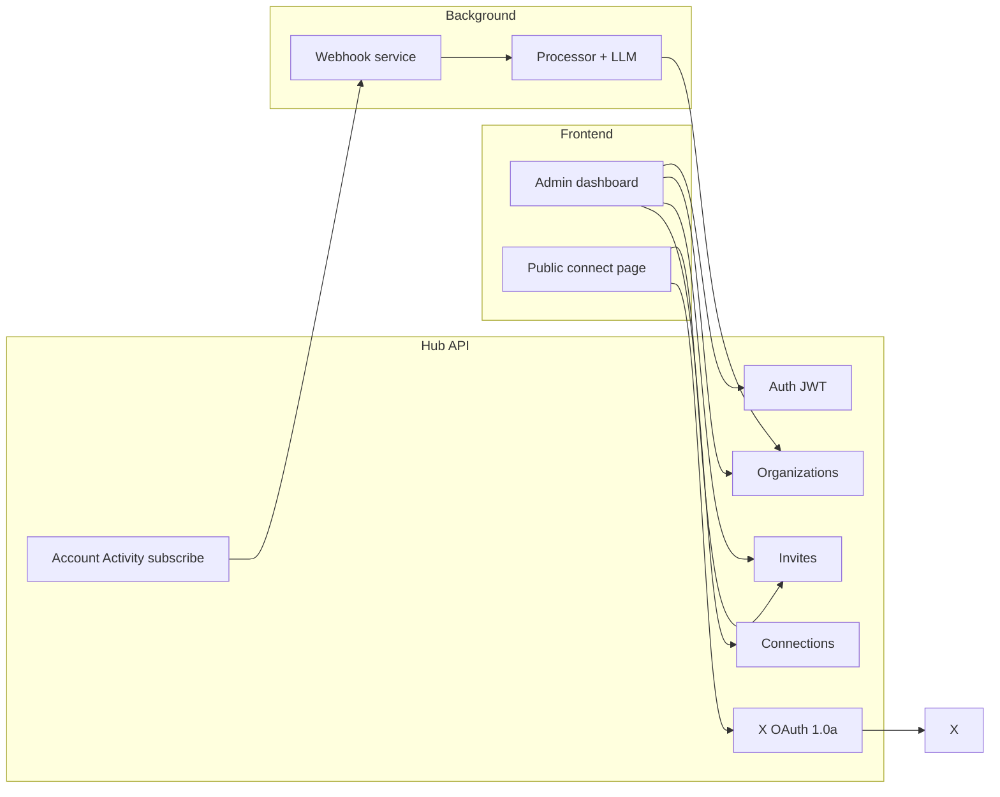

# Create and integrate a frontend with Hub

This guide explains how to run and extend the admin UI that talks to the **Hub** NestJS API (`apps/hub`). Hub is the control plane for organizations, X OAuth connections, invites, org-level LLM prompts, and Account Activity subscriptions. **Webhook** and **Processor** run in the background; the browser only calls Hub.

## Reference implementation

A production-ready app lives in the sibling repo **`x-executor-frontend`** (Bun + React 19 + Tailwind). It is **not** inside this monorepo.

| Item | Location |
|------|----------|
| App entry | `x-executor-frontend/src/index.tsx` |
| Routes | `x-executor-frontend/src/router.tsx` |
| Hub client | `x-executor-frontend/src/lib/hub/api.ts`, `client.ts` |
| Prompt editor | `x-executor-frontend/src/components/OrgPromptForm.tsx` |
| Env template | `x-executor-frontend/.env.example` |
| Deploy notes | `x-executor-frontend/README.md` |

You can fork that repo, or scaffold a new app (Vite/Next) using the API patterns below.

---

## Architecture



| Actor | What they do in the UI |
|-------|------------------------|
| **Org owner/admin** | Register/login, create org, invites, connections, per-connection auth tokens, **system prompt** + unknown reply |
| **Org member** | View connections only (no invites, prompts, or revoke) |
| **X account holder** (no Hub login) | Open invite link → authorize X; Hub stores tokens and subscribes to the shared webhook |

---

## Prerequisites

1. **Hub running** with MongoDB and Redis (see [railway.md](./railway.md) and `docs/env/hub.env.example`).
2. **X Developer App** with **OAuth 1.0a** enabled (Account Activity subscriptions require user context OAuth 1.0a, not OAuth 2 PKCE alone):
   - **Consumer Keys** (`X_API_KEY`, `X_API_KEY_SECRET`)
   - App permissions: **Read, Write, and Direct Messages**
   - **Account Activity API** product access on the app
   - Callback URL on Hub (must match exactly):
     - Local: `http://localhost:3000/api/v1/oauth/x/callback`
     - Production: `https://<hub-domain>/api/v1/oauth/x/callback`
3. **Shared webhook URL** (one per deployment): `{WEBHOOK_PUBLIC_BASE_URL}/api/v1/webhooks/incoming` — registered when users connect if `X_REGISTER_WEBHOOKS_WITH_X=true`.

### Start Hub locally

```bash
yarn install
# Merge docs/env/shared.env.example + docs/env/hub.env.example into .env
yarn start:hub:dev
```

Hub listens on `PORT` (default **3000**). Health: `GET /` → `{ "status": "ok" }`. Business routes use **`/api/v1`**.

```bash
yarn test:hub:e2e
```

### Start the reference frontend locally

```bash
# From x-executor-frontend/
bun install
cp .env.example .env
bun dev
```

Open http://localhost:5173. Hub must have:

```bash
OAUTH_SUCCESS_REDIRECT_URL=http://localhost:5173/oauth/success
HUB_PUBLIC_BASE_URL=http://localhost:3000
```

---

## Hub configuration for the frontend

Set these on **Hub** (not only in the frontend):

| Variable | Purpose |
|----------|---------|
| `HUB_PUBLIC_BASE_URL` | Public Hub URL; used in `inviteUrl` |
| `WEBHOOK_PUBLIC_BASE_URL` | Shared webhook ingress (Webhook service) |
| `OAUTH_SUCCESS_REDIRECT_URL` | After X OAuth, redirect browser here (SPA success page) |
| `X_REDIRECT_URI` | Stays on **Hub** (`/api/v1/oauth/x/callback`) |
| `X_API_KEY` / `X_API_KEY_SECRET` | OAuth 1.0a Consumer Keys |
| `X_REGISTER_WEBHOOKS_WITH_X` | `true` to register webhook + subscribe on connect |

On OAuth success, Hub redirects with query params: `orgId`, `xUserId`, `xUsername`, `webhookUrl`, `subscribed`, and optionally `invite`.

If `OAUTH_SUCCESS_REDIRECT_URL` is unset, the callback returns JSON (fine for API tests, poor for browsers).

---

## Create a new frontend (optional)

### Option A — Monorepo app (`apps/web`)

```bash
yarn create vite apps/web --template react-ts
```

Dev proxy example (`vite.config.ts`):

```ts
server: {
  proxy: {
    '/api': { target: 'http://localhost:3000', changeOrigin: true },
  },
},
```

Use an empty API base in dev so requests hit `/api/v1/...` via the proxy.

### Option B — Separate repo (recommended pattern)

The reference app uses **Bun** with a small server proxy (`src/hub-proxy.ts`): browser calls same-origin `/api/v1/*`, server forwards to `HUB_API_URL`.

On **Vercel** (static `dist/`), skip the proxy: set `PUBLIC_HUB_API_URL` to the Hub origin at **build time**. Hub enables CORS (`origin: '*'` in `apps/hub/src/main.ts`).

### CORS

Browsers send `Authorization: Bearer <jwt>`. For stricter production policy, allowlist origins in `apps/hub/src/main.ts` later.

Server-side BFF routes do not need CORS.

---

## Authentication

Hub uses **JWT** bearer tokens (email/password — separate from X OAuth).

| Endpoint | Auth | Body |
|----------|------|------|
| `POST /api/v1/auth/register` | None | `{ "email", "password" }` — password min 8 chars |
| `POST /api/v1/auth/login` | None | `{ "email", "password" }` |
| `GET /api/v1/auth/me` | Bearer | — |

Response: `{ "accessToken": "<jwt>" }`. Store in `localStorage` (or httpOnly cookie via BFF if required).

---

## API client pattern

Match `x-executor-frontend/src/lib/hub/client.ts`:

```ts
const base = (import.meta.env.PUBLIC_HUB_API_URL ?? '').replace(/\/$/, '');

export async function hubFetch<T>(
  path: string,
  options: RequestInit & { token?: string } = {},
): Promise<T> {
  const { token, headers, ...rest } = options;
  const res = await fetch(`${base}/api/v1${path}`, {
    ...rest,
    headers: {
      'Content-Type': 'application/json',
      ...(token ? { Authorization: `Bearer ${token}` } : {}),
      ...headers,
    },
  });
  if (!res.ok) {
    const err = await res.json().catch(() => ({}));
    throw new Error(
      Array.isArray(err.message) ? err.message.join(', ') : (err.message ?? res.statusText),
    );
  }
  return res.json() as Promise<T>;
}
```

Grouped helpers: `authApi`, `orgsApi`, `invitesApi`, `connectionsApi` in `api.ts`.

---

## User flows

### 1. Admin onboarding

1. Register → save `accessToken`.
2. `POST /api/v1/orgs` with `{ "name": "Acme" }` (optional `slug`).
3. `GET /api/v1/orgs` → each org includes `role` (`owner` | `admin` | `member`).

**Owner/admin only:** invites, prompts, members, revoke connections, set auth tokens.

### 2. Invite link for X users

1. `POST /api/v1/orgs/:orgId/invites` — optional `{ "expiresInHours": 24, "maxUses": 5 }` (defaults: 168h, unlimited).
2. Response: `inviteToken`, `inviteUrl` = `{HUB_PUBLIC_BASE_URL}/api/v1/oauth/x/start?invite=<token>`.

Show **Open connect page** or copy `inviteUrl`. Branded flow: `/connect/:token`.

### 3. Public connect page

Route: `/connect/:token`

1. `GET /api/v1/invites/:token` (no auth) → `{ orgName, expired, revoked, maxUsesReached, ... }`.
2. If valid, navigate to OAuth start (full page redirect, not `fetch`):

   ```
   {HUB_PUBLIC_BASE_URL}/api/v1/oauth/x/start?invite={token}
   ```

### 4. OAuth success page

Route: `/oauth/success` — must match `OAUTH_SUCCESS_REDIRECT_URL`.

Display query params: `orgId`, `xUserId`, `xUsername`, `webhookUrl`, `subscribed`. Do not show X access tokens or webhook secrets.

### 5. Connections (members can view; admin can mutate)

`GET /api/v1/orgs/:orgId/connections`

```json
[
  {
    "id": "...",
    "xUserId": "...",
    "xUsername": "handle",
    "scopes": [],
    "connectedAt": "...",
    "webhookUrl": "https://webhook.../api/v1/webhooks/incoming",
    "subscribed": true,
    "hasAuthToken": false
  }
]
```

| Action | Method | Path | Role |
|--------|--------|------|------|
| Set automation secret | `PATCH` | `/orgs/:orgId/connections/:id/auth-token` `{ "authToken" }` | admin |
| Revoke | `DELETE` | `/orgs/:orgId/connections/:id` | admin |

### 6. Organization prompts (admin) — required for DM replies

The processor skips automated replies when `systemPrompt` is empty (`apps/processor` reads org from MongoDB).

| Method | Path | Body |
|--------|------|------|
| `GET` | `/orgs/:orgId` | — returns `systemPrompt`, `unknownReply` |
| `PATCH` | `/orgs/:orgId/prompt` | `{ "systemPrompt"?, "unknownReply"? }` |

Limits (Hub validation): `systemPrompt` max 32 000 chars; `unknownReply` max 1 000 chars.

**Reference UI:**

- **Org dashboard** (`/orgs/:orgId`) — `OrgPromptForm` card for owner/admin; badge if prompt unset.
- **Settings** (`/orgs/:orgId/settings`) — same form + members table.
- **Org list** — hint when admin/owner and prompt missing.

```ts
await orgsApi.updatePrompt(token, orgId, {
  systemPrompt: 'You are support for Acme. Only answer from: ...',
  unknownReply: 'Please email support@acme.com',
});
```

### 7. Invites (admin)

| Method | Path |
|--------|------|
| `GET` | `/orgs/:orgId/invites` |
| `DELETE` | `/orgs/:orgId/invites/:inviteId` |

### 8. Members (admin)

`GET /api/v1/orgs/:orgId/members` → `{ userId, email, role, joinedAt }[]`

---

## Suggested frontend routes

| Route | Guard | Hub APIs / behavior |
|-------|-------|---------------------|
| `/login`, `/register` | Public | `auth/login`, `auth/register` |
| `/orgs` | JWT | `auth/me`, `orgs` list/create |
| `/orgs/:orgId` | JWT + member | `orgs/:orgId`, `connections`; **prompt form** if admin |
| `/orgs/:orgId/invites` | JWT + admin | invites CRUD |
| `/orgs/:orgId/settings` | JWT + admin | `orgs/:orgId/prompt`, `members` |
| `/connect/:token` | Public | `invites/:token` → redirect oauth start |
| `/oauth/success` | Public | Hub redirect query params |

Nav in the reference app: **Connections** (all members), **Invites** / **Settings** (admin only).

---

## Full API reference (Hub)

Base: `{HUB_ORIGIN}/api/v1`

| Method | Path | Auth | Notes |
|--------|------|------|-------|
| `GET` | `/` | — | Health (no prefix): `{ "status": "ok" }` |
| `POST` | `/auth/register` | — | 201 + `accessToken` |
| `POST` | `/auth/login` | — | 200 + `accessToken` |
| `GET` | `/auth/me` | JWT | Current user |
| `POST` | `/orgs` | JWT | Create org; creator = `owner` |
| `GET` | `/orgs` | JWT | List orgs with `role` |
| `GET` | `/orgs/:orgId` | JWT + member | Includes prompts |
| `PATCH` | `/orgs/:orgId/prompt` | JWT + admin | Update `systemPrompt` / `unknownReply` |
| `GET` | `/orgs/:orgId/members` | JWT + admin | Members |
| `POST` | `/orgs/:orgId/invites` | JWT + admin | Create invite |
| `GET` | `/orgs/:orgId/invites` | JWT + admin | List invites |
| `DELETE` | `/orgs/:orgId/invites/:inviteId` | JWT + admin | Revoke |
| `GET` | `/invites/:token` | — | Public invite metadata |
| `GET` | `/oauth/x/start?invite=` | — | 302 to X (browser navigation) |
| `GET` | `/oauth/x/callback` | — | X callback; redirect or JSON |
| `GET` | `/orgs/:orgId/connections` | JWT + member | List connections |
| `PATCH` | `/orgs/:orgId/connections/:id/auth-token` | JWT + admin | Encrypted secret |
| `DELETE` | `/orgs/:orgId/connections/:id` | JWT + admin | Revoke + unsubscribe |

Errors: `401` JWT, `403` not member/admin, `404`, `409` email taken, `410` invite invalid.

---

## Frontend environment variables

Reference app (`x-executor-frontend/.env.example`):

| Variable | Example | Purpose |
|----------|---------|---------|
| `PORT` | `5173` | Dev server port |
| `HUB_API_URL` | `http://localhost:3000` | Server proxy target (dev only) |
| `PUBLIC_HUB_API_URL` | *(empty locally)* | Client API base; production = Hub URL |
| `PUBLIC_HUB_PUBLIC_BASE_URL` | `http://localhost:3000` | OAuth start links (must be Hub) |

**Vercel:** set `PUBLIC_HUB_*` at build time; do not rely on `HUB_API_URL` for static hosting.

**Hub (production):**

```bash
OAUTH_SUCCESS_REDIRECT_URL=https://your-frontend.vercel.app/oauth/success
HUB_PUBLIC_BASE_URL=https://your-hub.railway.app
WEBHOOK_PUBLIC_BASE_URL=https://your-webhook.railway.app
```

---

## Local end-to-end checklist

1. MongoDB, Redis, Hub (`yarn start:hub:dev`), Webhook + Processor + NATS if testing DM pipeline.
2. Frontend on **5173** with Hub env above.
3. Register → create org → **save system prompt** on org dashboard.
4. Create invite → open `/connect/<token>` → Authorize with X → `/oauth/success`.
5. Admin: connection shows `@username`, `subscribed: true`, shared `webhookUrl`.
6. Optional: favorite a tweet on the connected account to verify webhook delivery (see [railway.md](./railway.md)).

---

## DM webhooks and XChat (platform limitation)

Account Activity `direct_message_events` only fire for **legacy, unencrypted** DMs. X is migrating users to **XChat** (E2EE); `x.com/messages` may not produce API webhook events. The frontend and Hub subscription can be correct while DMs still never arrive.

- Validate the pipeline with **non-DM** events (e.g. favorites) first.
- Future XChat support likely uses **Activity Stream** (`chat.received`) + OAuth 2 + client-side decryption — not the current Hub webhook URL.

---

## Production

1. Deploy Hub, Webhook, Processor per [railway.md](./railway.md).
2. Deploy `x-executor-frontend` (or your UI); align `OAUTH_SUCCESS_REDIRECT_URL` and `PUBLIC_HUB_*`.
3. X Developer Portal callback stays on **Hub**, not the frontend host.
4. Webhook service: `X_API_KEY_SECRET` must match Hub Consumer Secret for CRC/signature.

---

## What the frontend does not do

- **Ingest X webhooks** — Webhook service only.
- **Run LLM / send DMs** — Processor + NATS; driven by org `systemPrompt` in MongoDB.
- **Store or display X OAuth tokens** — Hub encrypts at rest.

---

## Related files

| Path | Role |
|------|------|
| `apps/hub/src/main.ts` | Global prefix `api/v1`, CORS |
| `apps/hub/src/oauth/` | OAuth 1.0a flow |
| `apps/hub/src/webhooks/` | Shared webhook register + subscribe |
| `apps/hub/src/organizations/` | Orgs + `PATCH .../prompt` |
| `apps/hub/test/app.e2e-spec.ts` | Integration reference |
| `apps/processor/src/dm/` | Uses `org.systemPrompt` |
| `docs/env/hub.env.example` | Hub env |
| `docs/env/webhook.env.example` | Webhook CRC secret |
| `docs/railway.md` | Deploy all services |
| `x-executor-frontend/README.md` | Run, Vercel, OAuth troubleshooting |
