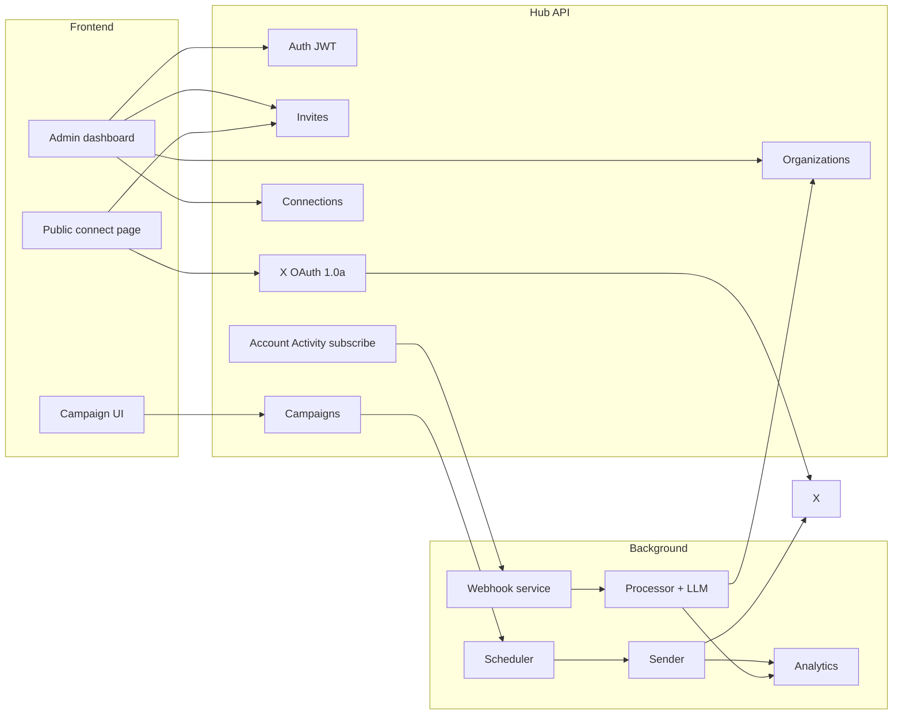
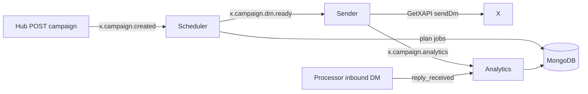
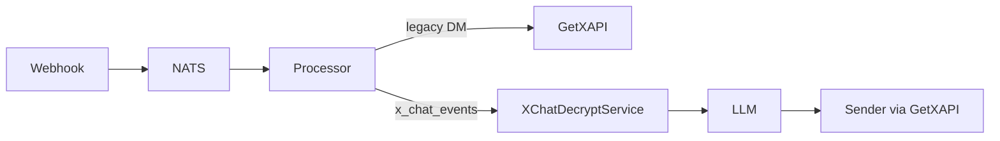

# Create and integrate a frontend with Hub

This guide explains how to run and extend the admin UI that talks to the **Hub** NestJS API (`apps/hub`). Hub is the control plane for organizations, X OAuth connections, invites, org-level LLM prompts, Account Activity subscriptions, and **bulk DM campaigns**. **Webhook**, **Processor**, **Sender**, **Scheduler**, and **Analytics** run in the background; the browser only calls Hub.

## Reference implementation

A production-ready app lives in the sibling repo **`x-executor-frontend`** (Bun + React 19 + Tailwind). It is **not** inside this monorepo.

| Item | Location |
|------|----------|
| App entry | `x-executor-frontend/src/index.tsx` |
| Routes | `x-executor-frontend/src/router.tsx` |
| Hub client | `x-executor-frontend/src/lib/hub/api.ts`, `client.ts` |
| Connection secrets UI | `x-executor-frontend/src/components/ConnectionAdminPanel.tsx` |
| Readiness badges | `x-executor-frontend/src/components/ConnectionStatusBadges.tsx` |
| Org dashboard | `x-executor-frontend/src/pages/OrgDashboardPage.tsx` |
| OAuth success → configure link | `x-executor-frontend/src/pages/OAuthSuccessPage.tsx` |
| Prompt editor | `x-executor-frontend/src/components/OrgPromptForm.tsx` |
| **Campaign create + progress** | `x-executor-frontend/src/pages/CampaignCreatePage.tsx`, `CampaignProgressPage.tsx`, `src/components/CampaignCreateForm.tsx` |
| Env template | `x-executor-frontend/.env.example` |
| Deploy notes | `x-executor-frontend/README.md` |

You can fork that repo, or scaffold a new app (Vite/Next) using the API patterns below.

---

## Architecture



| Actor | What they do in the UI |
|-------|------------------------|
| **Org owner/admin** | Register/login, create org, invites, connections, per-connection **auth token** + **XChat PIN**, **system prompt** + unknown reply, **create DM campaigns** |
| **Org member** | View connections and **campaign progress** (no invites, prompts, revoke, or campaign create) |
| **X account holder** (no Hub login) | Open invite link → authorize X; Hub stores tokens and subscribes to the shared webhook |

---

## Prerequisites

1. **Hub running** with MongoDB, Redis, and **NATS** (see [railway.md](./railway.md) and `docs/env/hub.env.example` + `docs/env/shared.env.example`).
2. For **campaign DMs**, also run **Scheduler**, **Sender**, and **Analytics** (same `MONGODB_URI` and `NATS_URL` as Hub). See [§9 Campaign DMs](#9-campaign-dms-bulk-outbound).
3. **X Developer App** with **OAuth 1.0a** enabled (Account Activity subscriptions require user context OAuth 1.0a, not OAuth 2 PKCE alone):
   - **Consumer Keys** (`X_API_KEY`, `X_API_KEY_SECRET`)
   - App permissions: **Read, Write, and Direct Messages**
   - **Account Activity API** product access on the app
   - Callback URL on Hub (must match exactly):
     - Local: `http://localhost:3000/xbot/v1/api/oauth/x/callback`
     - Production: `https://<hub-domain>/xbot/v1/api/oauth/x/callback`
3. **Shared webhook URL** (one per deployment): `{WEBHOOK_PUBLIC_BASE_URL}/xbot/v1/api/webhooks/incoming` — registered when users connect if `X_REGISTER_WEBHOOKS_WITH_X=true`.

### Start Hub locally

```bash
yarn install
# Merge docs/env/shared.env.example + docs/env/hub.env.example into .env
yarn start:hub:dev
```

Hub listens on `PORT` (default **3000**). Health: `GET /xbot/v1/api/health` → `{ "status": "ok" }`. Business routes use **`/xbot/v1/api`**.

```bash
yarn test:hub:e2e
```

### Start the reference frontend locally

```bash
# From x-executor-frontend/
bun install
cp .env.example .env
bun dev
```

Open http://localhost:5173. Hub must have:

```bash
OAUTH_SUCCESS_REDIRECT_URL=http://localhost:5173/oauth/success
HUB_PUBLIC_BASE_URL=http://localhost:3000
```

---

## Hub configuration for the frontend

Set these on **Hub** (not only in the frontend):

| Variable | Purpose |
|----------|---------|
| `HUB_PUBLIC_BASE_URL` | Public Hub URL; used in `inviteUrl` |
| `WEBHOOK_PUBLIC_BASE_URL` | Shared webhook ingress (Webhook service) |
| `OAUTH_SUCCESS_REDIRECT_URL` | After X OAuth, redirect browser here (SPA success page) |
| `X_REDIRECT_URI` | Stays on **Hub** (`/xbot/v1/api/oauth/x/callback`) |
| `X_API_KEY` / `X_API_KEY_SECRET` | OAuth 1.0a Consumer Keys |
| `X_REGISTER_WEBHOOKS_WITH_X` | `true` to register webhook + subscribe on connect |
| `NATS_URL` | Required for campaign create (`x.campaign.created` publish) |

On OAuth success, Hub redirects with query params: `orgId`, `xUserId`, `xUsername`, `webhookUrl`, `subscribed`, and optionally `invite`.

If `OAUTH_SUCCESS_REDIRECT_URL` is unset, the callback returns JSON (fine for API tests, poor for browsers).

---

## Create a new frontend (optional)

### Option A — Monorepo app (`apps/web`)

```bash
yarn create vite apps/web --template react-ts
```

Dev proxy example (`vite.config.ts`):

```ts
server: {
  proxy: {
    '/api': { target: 'http://localhost:3000', changeOrigin: true },
  },
},
```

Use an empty API base in dev so requests hit `/xbot/v1/api/...` via the proxy.

### Option B — Separate repo (recommended pattern)

The reference app uses **Bun** with a small server proxy (`src/hub-proxy.ts`): browser calls same-origin `/xbot/v1/api/*`, server forwards to `HUB_API_URL`.

On **Vercel** (static `dist/`), skip the proxy: set `PUBLIC_HUB_API_URL` to the Hub origin at **build time**. Hub enables CORS (`origin: '*'` in `apps/hub/src/main.ts`).

### CORS

Browsers send `Authorization: Bearer <jwt>`. For stricter production policy, allowlist origins in `apps/hub/src/main.ts` later.

Server-side BFF routes do not need CORS.

---

## Authentication

Hub uses **JWT** bearer tokens (email/password — separate from X OAuth).

| Endpoint | Auth | Body |
|----------|------|------|
| `POST /xbot/v1/api/auth/register` | None | `{ "email", "password" }` — password min 8 chars |
| `POST /xbot/v1/api/auth/login` | None | `{ "email", "password" }` |
| `GET /xbot/v1/api/auth/me` | Bearer | — |

Response: `{ "accessToken": "<jwt>" }`. Store in `localStorage` (or httpOnly cookie via BFF if required).

---

## API client pattern

Match `x-executor-frontend/src/lib/hub/client.ts`:

```ts
const base = (import.meta.env.PUBLIC_HUB_API_URL ?? '').replace(/\/$/, '');

export async function hubFetch<T>(
  path: string,
  options: RequestInit & { token?: string } = {},
): Promise<T> {
  const { token, headers, ...rest } = options;
  const res = await fetch(`${base}/xbot/v1/api${path}`, {
    ...rest,
    headers: {
      'Content-Type': 'application/json',
      ...(token ? { Authorization: `Bearer ${token}` } : {}),
      ...headers,
    },
  });
  if (!res.ok) {
    const err = await res.json().catch(() => ({}));
    throw new Error(
      Array.isArray(err.message) ? err.message.join(', ') : (err.message ?? res.statusText),
    );
  }
  return res.json() as Promise<T>;
}
```

Grouped helpers: `authApi`, `orgsApi`, `invitesApi`, `connectionsApi`, **`campaignsApi`** in `api.ts`.

---

## User flows

### 1. Admin onboarding

1. Register → save `accessToken`.
2. `POST /xbot/v1/api/orgs` with `{ "name": "Acme" }` (optional `slug`).
3. `GET /xbot/v1/api/orgs` → each org includes `role` (`owner` | `admin` | `member`).

**Owner/admin only:** invites, prompts, members, revoke connections, set auth tokens, set XChat PINs, **create campaigns**.

**Members:** view connections and campaign status only.

### 2. Invite link for X users

1. `POST /xbot/v1/api/orgs/:orgId/invites` — optional `{ "expiresInHours": 24, "maxUses": 5 }` (defaults: 168h, unlimited).
2. Response: `inviteToken`, `inviteUrl` = `{HUB_PUBLIC_BASE_URL}/xbot/v1/api/oauth/x/start?invite=<token>`.

Show **Open connect page** or copy `inviteUrl`. Branded flow: `/connect/:token`.

### 3. Public connect page

Route: `/connect/:token`

1. `GET /xbot/v1/api/invites/:token` (no auth) → `{ orgName, expired, revoked, maxUsesReached, ... }`.
2. If valid, navigate to OAuth start (full page redirect, not `fetch`):

   ```
   {HUB_PUBLIC_BASE_URL}/xbot/v1/api/oauth/x/start?invite={token}
   ```

### 4. OAuth success page

Route: `/oauth/success` — must match `OAUTH_SUCCESS_REDIRECT_URL`.

Display query params: `orgId`, `xUserId`, `xUsername`, `webhookUrl`, `subscribed`. Do not show X access tokens or webhook secrets.

### 5. Connections (members can view; admin can mutate)

`GET /xbot/v1/api/orgs/:orgId/connections`

```json
[
  {
    "id": "...",
    "xUserId": "...",
    "xUsername": "handle",
    "scopes": [],
    "connectedAt": "...",
    "webhookUrl": "https://webhook.../xbot/v1/api/webhooks/incoming",
    "subscribed": true,
    "hasAuthToken": false,
    "hasXchatPin": false
  }
]
```

| Action | Method | Path | Body | Role |
|--------|--------|------|------|------|
| Set automation secret | `PATCH` | `/orgs/:orgId/connections/:id/auth-token` | `{ "authToken": "..." }` | admin |
| Set XChat PIN | `PATCH` | `/orgs/:orgId/connections/:id/xchat-pin` | `{ "xchatPin": "1234" }` | admin |
| Revoke | `DELETE` | `/orgs/:orgId/connections/:id` | — | admin |

**Auth token** — browser `auth_token` cookie from X (used by GetXAPI for legacy DMs and outbound sends). Encrypted at rest as `authTokenEnc`.

**XChat PIN** — the 4–8 digit passcode the X account holder set in X Chat settings (`x.com/messages` → unlock). Required for the processor to decrypt **encrypted XChat** inbound messages. Each connected account can have a **different PIN**. Encrypted at rest as `xchatPinEnc`. When updated, Hub invalidates the cached unlock secret so the processor re-unlocks on the next message.

Show connection readiness in the UI:

| Flag | Meaning | Required for |
|------|---------|--------------|
| `hasAuthToken` | Outbound DM send + legacy DM fetch | Sending replies; legacy (non-XChat) DMs |
| `hasXchatPin` | XChat vault unlock configured | Encrypted XChat inbound decrypt |
| `subscribed` | Account Activity subscription active | Any webhook delivery |
| Org `systemPrompt` set | LLM instructions | Automated **inbound** replies |
| `hasAuthToken` on ≥1 connection | Outbound send secret | **Campaign DMs** (bulk outbound) |

Example API helper:

```ts
await connectionsApi.setXchatPin(token, orgId, connectionId, '1234');
// → { updated: true, hasXchatPin: true }
```

Do **not** persist the PIN in frontend storage after the request succeeds — treat it like a password field (collect, submit once, discard).

### 6. Organization prompts (admin) — required for DM replies

The processor skips automated replies when `systemPrompt` is empty (`apps/processor` reads org from MongoDB).

| Method | Path | Body |
|--------|------|------|
| `GET` | `/orgs/:orgId` | — returns `systemPrompt`, `unknownReply` |
| `PATCH` | `/orgs/:orgId/prompt` | `{ "systemPrompt"?, "unknownReply"? }` |

Limits (Hub validation): `systemPrompt` max 32 000 chars; `unknownReply` max 1 000 chars.

**Reference UI:**

- **Org dashboard** (`/orgs/:orgId`) — `OrgPromptForm` card for owner/admin; badge if prompt unset.
- **Settings** (`/orgs/:orgId/settings`) — same form + members table.
- **Org list** — hint when admin/owner and prompt missing.

```ts
await orgsApi.updatePrompt(token, orgId, {
  systemPrompt: 'You are support for Acme. Only answer from: ...',
  unknownReply: 'Please email support@acme.com',
});
```

### 7. Invites (admin)

| Method | Path |
|--------|------|
| `GET` | `/orgs/:orgId/invites` |
| `DELETE` | `/orgs/:orgId/invites/:inviteId` |

### 8. Members (admin)

`GET /xbot/v1/api/orgs/:orgId/members` → `{ userId, email, role, joinedAt }[]`

### 9. Campaign DMs (bulk outbound)

Send **one message** to **many X usernames**. Hub persists the campaign and publishes to NATS; **Scheduler** plans jobs across all org connections that have `hasAuthToken`, **Sender** delivers DMs via GetXAPI with rate limiting, and **Analytics** updates progress in MongoDB. The frontend **only talks to Hub** — poll status via Hub; do not call Scheduler or Analytics directly.

#### Prerequisites (show in UI before launch)

| Requirement | How to check in UI |
|-------------|-------------------|
| At least one connected account with auth token | `GET .../connections` → any `hasAuthToken: true` |
| Background services running | Ops/deploy — Hub `NATS_URL`, plus Scheduler, Sender, Analytics on same MongoDB + NATS |

Campaign sends do **not** require org `systemPrompt` (that is only for inbound LLM auto-replies). They **do** require `authTokenEnc` on sending accounts.

#### Create campaign (admin only)

`POST /xbot/v1/api/orgs/:orgId/campaigns`

```json
{
  "targetUsernames": ["alice", "@Bob", "charlie"],
  "messageText": "Hi — we're reaching out from Acme."
}
```

Validation (Hub):

- `targetUsernames` — non-empty array, max **10 000** strings
- `messageText` — non-empty string
- Usernames are normalized server-side: trim, strip leading `@`, lowercase, deduplicated

**201 response:**

```json
{
  "id": "674a...",
  "status": "pending",
  "totalTargets": 3,
  "messageText": "Hi — we're reaching out from Acme.",
  "targetUsernames": ["alice", "bob", "charlie"],
  "createdAt": "2026-06-08T12:00:00.000Z"
}
```

After create, redirect to a **campaign detail / progress** route (e.g. `/orgs/:orgId/campaigns/:campaignId`) and start polling status.

#### Campaign status (member or admin)

`GET /xbot/v1/api/orgs/:orgId/campaigns/:campaignId/status`

```json
{
  "id": "674a...",
  "orgId": "...",
  "status": "running",
  "messageText": "Hi — we're reaching out from Acme.",
  "targetUsernames": ["alice", "bob", "charlie"],
  "totalTargets": 3,
  "messagesScheduled": 3,
  "messagesSent": 1,
  "repliesReceived": 0,
  "failedCount": 0,
  "remaining": 2,
  "progressPercent": 33,
  "startedAt": "2026-06-08T12:00:05.000Z",
  "expectedEndAt": "2026-06-08T12:15:00.000Z",
  "completedAt": null,
  "createdAt": "2026-06-08T12:00:00.000Z",
  "updatedAt": "2026-06-08T12:01:00.000Z"
}
```

**`status` values:**

| Value | Meaning | UI treatment |
|-------|---------|--------------|
| `pending` | Saved; Scheduler has not finished planning jobs yet | Spinner; poll every 5–10s |
| `running` | Jobs scheduled and/or sending | Progress bar; poll every 10–30s |
| `completed` | All targets processed (`messagesSent + failedCount >= totalTargets`) | Success state; stop polling |
| `failed` | Planning failed (e.g. no accounts with auth token) | Error banner; link to connections |

**Fields to display:**

- **Progress:** `progressPercent`, or `messagesSent + failedCount` / `totalTargets`
- **Sent / failed / replies:** `messagesSent`, `failedCount`, `repliesReceived`
- **ETA:** `expectedEndAt` (relative time, e.g. “~12 min remaining”)
- **Message preview:** `messageText` (read-only on detail page)

`repliesReceived` increments when a campaign target replies to a connected account (Processor detects inbound DMs from known recipients).

#### API client helpers

Add to `x-executor-frontend/src/lib/hub/api.ts`:

```ts
export type CampaignStatus =
  | 'pending'
  | 'running'
  | 'completed'
  | 'failed';

export interface CreateCampaignBody {
  targetUsernames: string[];
  messageText: string;
}

export interface CreateCampaignResponse {
  id: string;
  status: CampaignStatus;
  totalTargets: number;
  messageText: string;
  targetUsernames: string[];
  createdAt: string;
}

export interface CampaignStatusResponse {
  id: string;
  orgId: string;
  status: CampaignStatus;
  messageText: string;
  targetUsernames: string[];
  totalTargets: number;
  messagesScheduled: number;
  messagesSent: number;
  repliesReceived: number;
  failedCount: number;
  remaining: number;
  progressPercent: number;
  startedAt?: string;
  expectedEndAt?: string;
  completedAt?: string;
  createdAt: string;
  updatedAt: string;
}

export const campaignsApi = {
  create(token: string, orgId: string, body: CreateCampaignBody) {
    return hubFetch<CreateCampaignResponse>(`/orgs/${orgId}/campaigns`, {
      method: 'POST',
      token,
      body: JSON.stringify(body),
    });
  },

  getStatus(token: string, orgId: string, campaignId: string) {
    return hubFetch<CampaignStatusResponse>(
      `/orgs/${orgId}/campaigns/${campaignId}/status`,
      { token },
    );
  },
};
```

#### Suggested UI components

| Component | Route | Role | Behavior |
|-----------|-------|------|----------|
| `CampaignCreateForm` | `/orgs/:orgId/campaigns/new` | admin | Textarea for targets (one `@handle` per line); message textarea; validate non-empty; block submit if no `hasAuthToken` connections |
| `CampaignProgressPage` | `/orgs/:orgId/campaigns/:campaignId` | member+ | Poll `getStatus`; progress bar; stats grid; ETA from `expectedEndAt` |
| `CampaignStatusBadge` | inline | all | Chip colors: pending=gray, running=blue, completed=green, failed=red |
| `CampaignLaunchChecklist` | create page | admin | Warn if zero connections or zero `hasAuthToken` |

**Parse usernames in the client** (optional UX — server also normalizes):

```ts
function parseTargetUsernames(raw: string): string[] {
  return [
    ...new Set(
      raw
        .split(/[\n,]+/)
        .map((u) => u.trim().replace(/^@/, ''))
        .filter(Boolean),
    ),
  ];
}
```

**Polling example:**

```ts
useEffect(() => {
  if (!campaignId || !['pending', 'running'].includes(status)) return;
  const id = setInterval(() => {
    campaignsApi.getStatus(token, orgId, campaignId).then(setCampaign);
  }, 15_000);
  return () => clearInterval(id);
}, [campaignId, status, orgId, token]);
```

#### Background pipeline (no frontend calls)



Hub reads the same MongoDB `campaigns` collection for status — no separate Analytics HTTP API for the UI.

#### Campaign troubleshooting (admin UI)

| Symptom | Likely cause | UI action |
|---------|--------------|-----------|
| Stuck on `pending` | Scheduler not running or NATS misconfigured | Check deploy; Hub needs `NATS_URL` |
| `failed` immediately | No connections with auth token | Connections → set auth token on ≥1 account |
| `failedCount` rising | Invalid usernames, rate limits, or revoked tokens | Show failed count; verify handles and tokens |
| `repliesReceived` stays 0 | Targets not replying, or inbound pipeline down | Expected for cold outreach; inbound replies need Webhook + Processor |
| Slow sends | Anti-detection pacing (by design) | Show `expectedEndAt`; do not expect instant delivery |

---

## Frontend routes (reference app)

The sibling repo **`x-executor-frontend`** implements these routes (including campaigns):

| Route | Guard | Hub APIs / behavior |
|-------|-------|---------------------|
| `/login`, `/register` | Public | `auth/login`, `auth/register` |
| `/orgs` | JWT | `auth/me`, `orgs` list/create |
| `/orgs/:orgId` | JWT + member | `orgs/:orgId`, `connections`; **prompt form** if admin; **auth token + XChat PIN** fields per connection (admin only) |
| `/orgs/:orgId/campaigns/new` | JWT + admin | Create campaign form → `POST .../campaigns` |
| `/orgs/:orgId/campaigns/:campaignId` | JWT + member | Poll `GET .../campaigns/:id/status` until terminal state |
| `/orgs/:orgId/invites` | JWT + admin | invites CRUD |
| `/orgs/:orgId/settings` | JWT + admin | `orgs/:orgId/prompt`, `members` (no connection secrets here) |
| `/connect/:token` | Public | `invites/:token` → redirect oauth start |
| `/oauth/success` | Public | Hub redirect query params; link to org dashboard to configure secrets |

Nav in the reference app: **Connections** (all members), **Campaigns** (admin — create + progress via redirect), **Invites** / **Settings** (admin only).

### Where admins save the XChat PIN

1. Log in → **Organizations** → open org → **`/orgs/:orgId`** (org dashboard).
2. Each connected X account is a card with readiness badges (`subscribed`, `auth token`, `XChat PIN`).
3. **Owner/admin only:** expand the card footer — `ConnectionAdminPanel` shows password fields for **Auth token** and **XChat PIN**.
4. Enter the 4–8 digit PIN (same as x.com/messages unlock) → **Save XChat PIN**.
5. On success the field clears, a green confirmation appears, and badges refresh (`hasXchatPin: true`).

After OAuth connect, `/oauth/success` includes a **Configure connection (admin)** button when `orgId` is present.

See also `x-executor-frontend/README.md` → **Connection readiness**.

---

## Full API reference (Hub)

Base: `{HUB_ORIGIN}/xbot/v1/api`

| Method | Path | Auth | Notes |
|--------|------|------|-------|
| `GET` | `/` | — | Health (no prefix): `{ "status": "ok" }` |
| `POST` | `/auth/register` | — | 201 + `accessToken` |
| `POST` | `/auth/login` | — | 200 + `accessToken` |
| `GET` | `/auth/me` | JWT | Current user |
| `POST` | `/orgs` | JWT | Create org; creator = `owner` |
| `GET` | `/orgs` | JWT | List orgs with `role` |
| `GET` | `/orgs/:orgId` | JWT + member | Includes prompts |
| `PATCH` | `/orgs/:orgId/prompt` | JWT + admin | Update `systemPrompt` / `unknownReply` |
| `GET` | `/orgs/:orgId/members` | JWT + admin | Members |
| `POST` | `/orgs/:orgId/invites` | JWT + admin | Create invite |
| `GET` | `/orgs/:orgId/invites` | JWT + admin | List invites |
| `DELETE` | `/orgs/:orgId/invites/:inviteId` | JWT + admin | Revoke |
| `GET` | `/invites/:token` | — | Public invite metadata |
| `GET` | `/oauth/x/start?invite=` | — | 302 to X (browser navigation) |
| `GET` | `/oauth/x/callback` | — | X callback; redirect or JSON |
| `GET` | `/orgs/:orgId/connections` | JWT + member | List connections (`hasAuthToken`, `hasXchatPin`) |
| `PATCH` | `/orgs/:orgId/connections/:id/auth-token` | JWT + admin | Encrypted `authTokenEnc` |
| `PATCH` | `/orgs/:orgId/connections/:id/xchat-pin` | JWT + admin | Encrypted `xchatPinEnc`; body `{ "xchatPin": "1234" }` (4–8 digits) |
| `DELETE` | `/orgs/:orgId/connections/:id` | JWT + admin | Revoke + unsubscribe |
| `POST` | `/orgs/:orgId/campaigns` | JWT + admin | Create bulk DM campaign; body `{ "targetUsernames", "messageText" }` |
| `GET` | `/orgs/:orgId/campaigns/:campaignId/status` | JWT + member | Campaign progress and stats |

Errors: `401` JWT, `403` not member/admin, `404`, `409` email taken, `410` invite invalid.

---

## Frontend environment variables

Reference app (`x-executor-frontend/.env.example`):

| Variable | Example | Purpose |
|----------|---------|---------|
| `PORT` | `5173` | Dev server port |
| `HUB_API_URL` | `http://localhost:3000` | Server proxy target (dev only) |
| `PUBLIC_HUB_API_URL` | *(empty locally)* | Client API base; production = Hub URL |
| `PUBLIC_HUB_PUBLIC_BASE_URL` | `http://localhost:3000` | OAuth start links (must be Hub) |

**Vercel:** set `PUBLIC_HUB_*` at build time; do not rely on `HUB_API_URL` for static hosting.

**Hub (production):**

```bash
OAUTH_SUCCESS_REDIRECT_URL=https://your-frontend.vercel.app/oauth/success
HUB_PUBLIC_BASE_URL=https://your-hub.railway.app
WEBHOOK_PUBLIC_BASE_URL=https://your-webhook.railway.app
```

---

## Local end-to-end checklist

1. MongoDB, Redis, NATS, Hub (`yarn start:hub:dev`), Webhook + Processor + Sender + Scheduler + Analytics if testing DM or **campaign** pipelines.
2. Frontend on **5173** with Hub env above.
3. Register → create org → **save system prompt** on org dashboard.
4. Create invite → open `/connect/<token>` → Authorize with X → `/oauth/success`.
5. Admin: connection shows `@username`, `subscribed: true`, shared `webhookUrl`.
6. Admin: set **auth token** and **XChat PIN** on the connection (see §5). Without `hasXchatPin`, encrypted XChat messages are skipped by the processor.
7. Optional: send an XChat DM to the connected account to verify decrypt → LLM → reply pipeline.
8. Optional: favorite a tweet on the connected account to verify webhook delivery (see [railway.md](./railway.md)).
9. **Campaign:** admin → `/orgs/:orgId/campaigns/new` → enter usernames + message → submit → watch progress on `/orgs/:orgId/campaigns/:id` (requires `hasAuthToken` on ≥1 connection and background Scheduler/Sender/Analytics).

---

## DM webhooks, legacy DMs, and XChat

### Event types

| Source | Webhook field | Processor behavior |
|--------|---------------|-------------------|
| Legacy DM | `direct_message_events` | Fetch plaintext via GetXAPI (`auth_token`) |
| XChat (encrypted) | `x_chat_events` + `encoded_event` | Decrypt in processor using OAuth tokens + **per-connection XChat PIN** |
| XAA envelope | `chat.received` (normalized to `x_chat_events`) | Same as XChat when encrypted fields present |

Legacy Account Activity `direct_message_events` only fire for **unencrypted** DMs. Many users are on **XChat** (E2EE); those arrive as `x_chat_events` with base64 `encoded_event` and `conversation_key_change_event` blobs — not as plaintext in the webhook.

### What the frontend must configure for XChat

After OAuth connect, an admin should complete **both** secrets on each connection:

1. **Auth token** — `PATCH .../auth-token` (for outbound sends and legacy DM paths).
2. **XChat PIN** — `PATCH .../xchat-pin` (for inbound decrypt). Ask the X account holder for the same PIN they use to unlock X Chat in the browser/app.

The UI shows a destructive badge when `hasXchatPin: false` (`ConnectionStatusBadges`: “XChat PIN required”).

### What happens in the backend (no frontend work)



Processor requirements (Railway — not set in the frontend): `X_API_KEY`, `X_API_KEY_SECRET` (same OAuth 1.0a Consumer Keys as Hub), plus org `systemPrompt`.

### Troubleshooting from the admin UI

| Symptom | Likely cause | UI action |
|---------|--------------|-----------|
| Connection listed, no replies | Missing `systemPrompt` | Org dashboard → save prompt |
| Legacy DMs work, XChat silent | Missing `hasXchatPin` | Org dashboard → connection card → **Save XChat PIN** |
| Replies fail to send | Missing `hasAuthToken` | Org dashboard → connection card → **Save auth token** |
| Wrong PIN / changed on X | Decrypt fails in logs | Re-submit correct PIN on org dashboard |

Validate non-DM webhooks first (e.g. favorites) if unsure whether ingress is working — see [railway.md](./railway.md).

---

## Production

1. Deploy Hub, Webhook, Processor, Sender, Scheduler, Analytics, and NATS per [railway.md](./railway.md).
2. Deploy `x-executor-frontend` (or your UI); align `OAUTH_SUCCESS_REDIRECT_URL` and `PUBLIC_HUB_*`.
3. X Developer Portal callback stays on **Hub**, not the frontend host.
4. Webhook service: `X_API_KEY_SECRET` must match Hub Consumer Secret for CRC/signature.
5. Hub, Scheduler, Sender, and Analytics share **`MONGODB_URI`** and **`NATS_URL`**. Hub publishes campaigns; Scheduler/Sender/Analytics consume NATS subjects under `x.campaign.*`.

---

## What the frontend does not do

- **Ingest X webhooks** — Webhook service only.
- **Run LLM / send DMs / decrypt XChat** — Processor + Sender + NATS; inbound replies driven by org `systemPrompt` and connection secrets in MongoDB.
- **Schedule or send campaign DMs** — Scheduler + Sender; frontend only creates campaigns and polls Hub status.
- **Store or display X OAuth tokens** — Hub encrypts OAuth access tokens at rest.
- **Store XChat PINs after submit** — collect in a password-style field, send once to Hub, then discard from client state.

---

## Connection secrets UI (implemented in x-executor-frontend)

Per connection on **`/orgs/:orgId`** (not on `/orgs/:orgId/settings`):

| Field | Component | Input | Submit to |
|-------|-----------|-------|-----------|
| Auth token | `ConnectionAdminPanel` | Password, masked | `PATCH .../auth-token` |
| XChat PIN | `ConnectionAdminPanel` | Password, 4–8 digits (`/^\d{4,8}$/`) | `PATCH .../xchat-pin` |
| Status | `ConnectionStatusBadges` | Read-only chips | `hasAuthToken`, `hasXchatPin`, `subscribed` |

Behavior:

- **Save XChat PIN** disabled until PIN matches `/^\d{4,8}$/`; non-digits stripped on input.
- On 200: input cleared, inline success message, connection list refreshed (badges update).
- PIN never stored in `localStorage` — only sent once to Hub (`xchatPinEnc` at rest).

API client: `connectionsApi.setXchatPin()` in `x-executor-frontend/src/lib/hub/api.ts`. Tests: `src/lib/hub/api.test.ts`.

---

## Related files

| Path | Role |
|------|------|
| `apps/hub/src/main.ts` | Global prefix `xbot/v1/api`, CORS |
| `apps/hub/src/connections/` | Connections list, `auth-token`, **`xchat-pin`** |
| `apps/hub/src/campaigns/` | **Campaign create + status API** |
| `apps/hub/src/oauth/` | OAuth 1.0a flow |
| `apps/hub/src/webhooks/` | Shared webhook register + subscribe |
| `apps/hub/src/organizations/` | Orgs + `PATCH .../prompt` |
| `apps/scheduler/src/campaign/` | Job planning + dispatch (background) |
| `apps/sender/src/campaign/` | Campaign DM send (background) |
| `apps/analytics/src/campaign/` | Campaign stats consumer (background) |
| `apps/hub/test/app.e2e-spec.ts` | Integration reference |
| `apps/processor/src/dm/` | DM pipeline; XChat decrypt branch |
| `apps/processor/src/xchat/` | Juicebox unlock + 3-level cache |
| `docs/env/hub.env.example` | Hub env (+ merge `shared.env.example` for `NATS_URL`) |
| `docs/env/scheduler.env.example` | Campaign pacing limits |
| `docs/env/analytics.env.example` | Analytics consumer env |
| `docs/env/webhook.env.example` | Webhook CRC secret |
| `docs/railway.md` | Deploy all services |
| `x-executor-frontend/README.md` | Run, Vercel, OAuth troubleshooting, connection readiness |
| `x-executor-frontend/src/lib/hub/api.ts` | `connectionsApi`, **`campaignsApi`** |
| `x-executor-frontend/src/components/CampaignCreateForm.tsx` | Campaign launch form (admin) |
| `x-executor-frontend/src/components/CampaignLaunchChecklist.tsx` | Pre-flight auth-token checks |
| `x-executor-frontend/src/components/CampaignStatusBadge.tsx` | Campaign status chip |
| `x-executor-frontend/src/pages/CampaignCreatePage.tsx` | `/orgs/:orgId/campaigns/new` |
| `x-executor-frontend/src/pages/CampaignProgressPage.tsx` | `/orgs/:orgId/campaigns/:campaignId` |
| `x-executor-frontend/src/components/ConnectionAdminPanel.tsx` | Auth token + XChat PIN form (admin) |
| `x-executor-frontend/src/components/ConnectionStatusBadges.tsx` | `hasAuthToken`, `hasXchatPin`, `subscribed` badges |
| `x-executor-frontend/src/pages/OrgDashboardPage.tsx` | Renders connection cards + admin panel |
| `x-executor-frontend/src/pages/OAuthSuccessPage.tsx` | Post-OAuth link to org dashboard |
